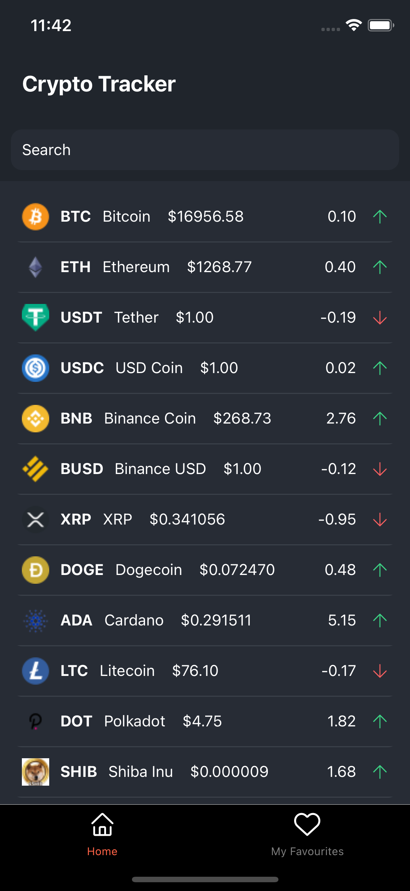
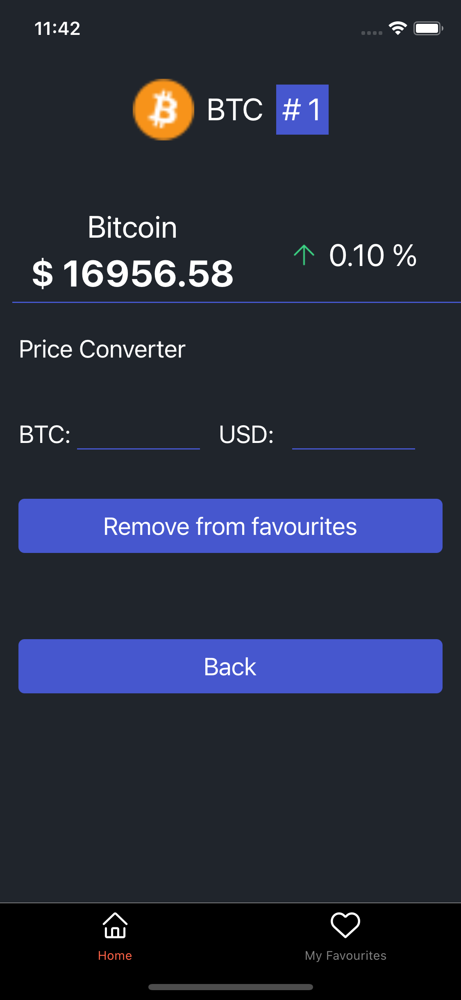
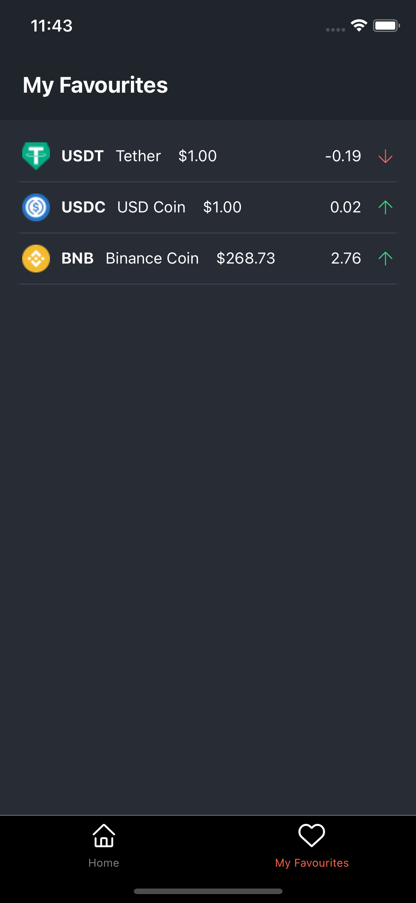

### Crypto Tracker

Crypto Tracker is a simple app that allows you to track the price of cryptocurrencies. It uses the [Coinlore API](https://api.coinlore.net/api/tickers/) to fetch the data.

### App Screenshots

  

## Features 

- [X] Add details page for each coin
- [X] Favorite coins section
- [X] Search coins
- [X] Pull to refresh

